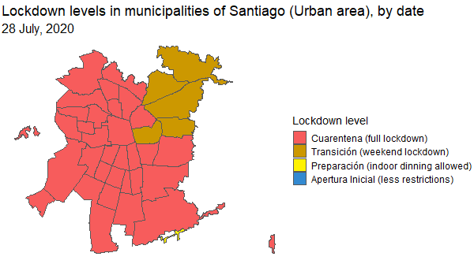

A map created with `gganimate` showing how COVID restrictions and lockdown severity evolved in Santiago (Chile) since the outbreak of the COVID-19 pandemic.

The data was retrieved from the [official COVID data repository of the Chilean government](https://github.com/MinCiencia/Datos-COVID19/), while the geographic layout (geometries) comes from the [`sinimr` R package](https://github.com/robsalasco/sinimr).

Each frame of the animated plot represents a day, and the colours represent the levels of the four-tier restriction system implemented in Chile between 2020 and 2022 as a response to the pandemic.