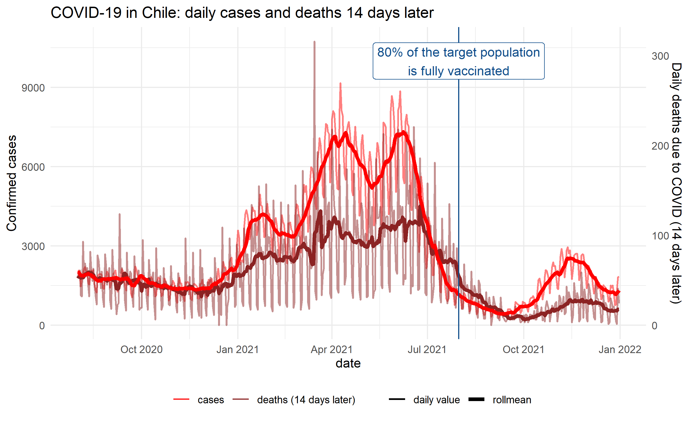
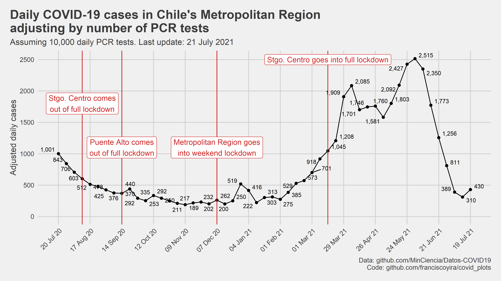
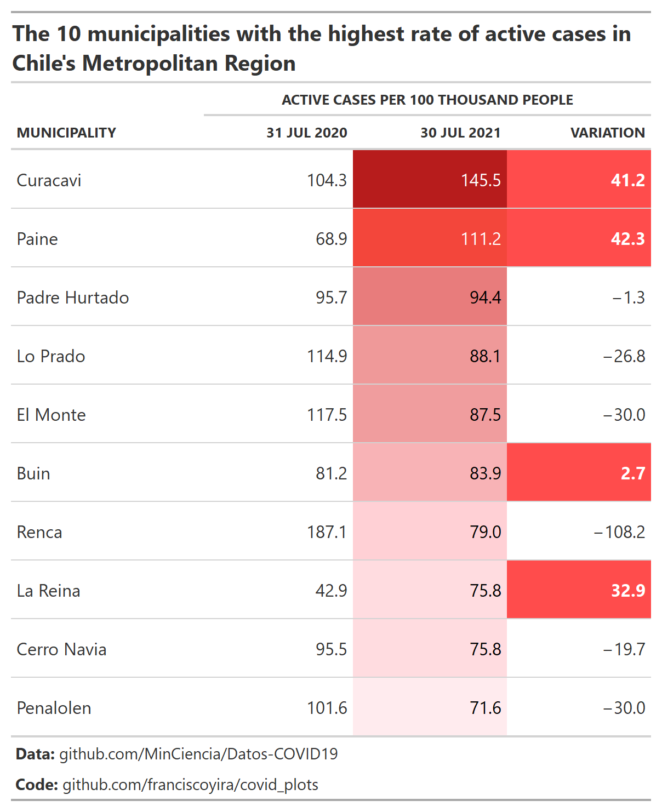

A series of plots and tables that offer different perspectives on the evolution of the pandemic in Chile.

## Daily COVID cases and lagged deaths during the vaccination process

A time series plot to track the relationship between COVID cases and deaths in Chile since the country started its vaccination process. The deaths series is lagged in 14 days under the assumption that COVID cases today predict deaths 14 days later. For both series, a 7-day roll mean is also shown to get rid off the weekly seasonality and to better visualise the underlying trends.

Code: [R script](https://github.com/franciscoyira/covid_plots/blob/main/cases_vs_offset_deaths.R)

## Adjusted daily confirmed COVID cases in the Metropolitan Region

Confirmed COVID cases can increase both due to an increase in real cases or an increase in testing (e.g. if there is a exogeneous increase in PCR tests, confirmed cases are going to increase even if the virus prevalence is the same). This plot was an attempt to adjust by this later source of variation and get an estimate of COVID cases would the testing rate been held constant (i.e. an estimate that only fluctuates due to the prevalence of the virus in the population).

Under the hood, this plot uses a linear model with daily data that has a different intercept for each week but a constant slope (confirmed cases \~ PCR tests) for all the weekly regression lines. The data point shown for each week is the fitted value of each regression line for PCR tests = 10,000. A key assumption is that the prevalence of the virus is approximately constant within each week but varies across weeks.

BTW, I don't have an epidemiology background, so you shouldn't take this too seriously, nor take this methodology as something to replicate. I made this just to inform conversations with friends and coworkers about the outlook of the pandemic in Santiago.

Code: [R script](https://github.com/franciscoyira/covid_plots/blob/main/adjusted_covid_cases.R)

## Ranking of municipalities with the highest rates of active cases in the Metropolitan Region

Table created with the `gt` R package showing the 10 municipalities with the highest rates of COVID active cases (confirmed cases minus deaths and recoveries) in a given week of 2021. It includes a benchmark column (the first one) showing the corresponding active cases rate during the peak of the first COVID wave (mid-2020) and the percent change between the two active cases rates.

Increases in the active cases rates are highlighted with red in the "Variation" column. However, note that this comparison doesn't consider factors such as the increase in PCR tests, so a higher active cases rate doesn't necessarily mean a higher virus prevalence in the population.

Code: [R script](https://github.com/franciscoyira/covid_plots/blob/main/top10_rm_casos_activos.R)