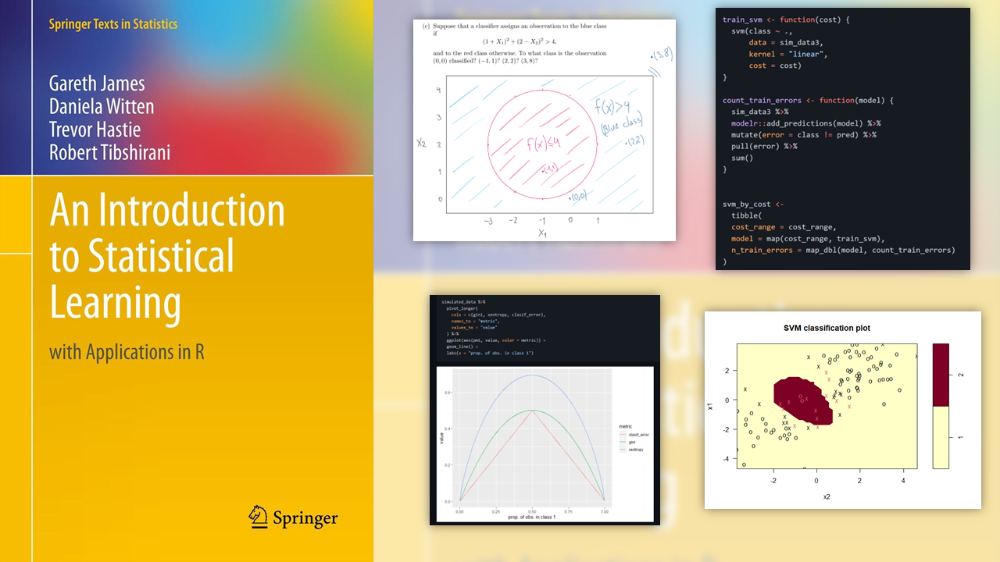

My solutions to the exercises of [ISLR](https://book.huihoo.com/introduction-to-statistical-learning/book.html), a foundational textbook that explains the intuition behind famous machine learning algorithms such as Gradient Boosting, Hierarchical Clustering and Elastic Nets, and shows how to implement them in R.

The solutions go from the chapter 3 (Linear Regression) to the chapter 10 (Unsupervised Learning and Clustering) and correspond to the 6th printing of the book, which was the latest available when I started reading it[^1]. Both code and conceptual exercises are included.

[^1]: A new printing has been released since then, including topics that were not covered previously, such as Deep Learning. My solutions haven't been updated to that edition.

Below are direct links to the exercise solutions in each chapter

-   Chapter 3 - Linear Regression: [Exercises and Labs](https://github.com/franciscoyira/islr-exercises/blob/master/ch3.md)
-   Chapter 4 - Classification
    -   [Lab](https://github.com/franciscoyira/islr-exercises/blob/master/ch4_lab.md)
    -   [Exercises](https://github.com/franciscoyira/islr-exercises/blob/master/ch4.md)
-   Chapter 5 - Re-sampling Methods (e.g. Bootstrap and Cross Validation)
    -   [Lab](https://github.com/franciscoyira/islr-exercises/blob/master/ch5_lab.md)
    -   [Exercises](https://github.com/franciscoyira/islr-exercises/blob/master/ch5.md)
-   Chapter 6 - Linear Model Selection and Regularization
    -   [Lab 1](https://github.com/franciscoyira/islr-exercises/blob/master/ch6_lab1.md)
    -   [Lab 2](https://github.com/franciscoyira/islr-exercises/blob/master/ch6_lab2.md)
    -   [Lab 3](https://github.com/franciscoyira/islr-exercises/blob/master/ch6_lab3.md)
    -   [Exercises](https://github.com/franciscoyira/islr-exercises/blob/master/ch6.md)
-   Chapter 7 - Moving Beyond Linearity
    -   [Lab](https://github.com/franciscoyira/islr-exercises/blob/master/ch7_lab.md)
    -   [Exercises](https://github.com/franciscoyira/islr-exercises/blob/master/ch7.md)
-   Chapter 8 - Tree-Based Methods (e.g. Random Forest and Gradient Boosting)
    -   [Lab](https://github.com/franciscoyira/islr-exercises/blob/master/ch8_lab.md)
    -   [Exercises](https://github.com/franciscoyira/islr-exercises/blob/master/ch8.md)
-   Chapter 9 - Support Vector Machines
    -   [Lab](https://github.com/franciscoyira/islr-exercises/blob/master/ch9_lab.md)
    -   [Exercises](https://github.com/franciscoyira/islr-exercises/blob/master/ch9.md)
-   Chapter 10 - Unsupervised Learning
    -   [Lab 1](https://github.com/franciscoyira/islr-exercises/blob/master/ch10_lab1.md)
    -   [Lab 2](https://github.com/franciscoyira/islr-exercises/blob/master/ch10_lab2.md)
    -   [Lab 3](https://github.com/franciscoyira/islr-exercises/blob/master/ch10_lab3.md)
    -   [Exercises](https://github.com/franciscoyira/islr-exercises/blob/master/ch10.md)
