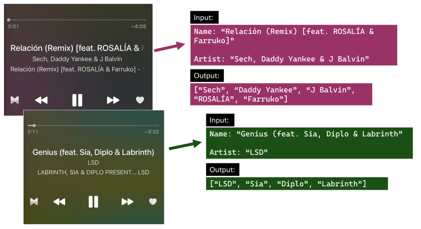
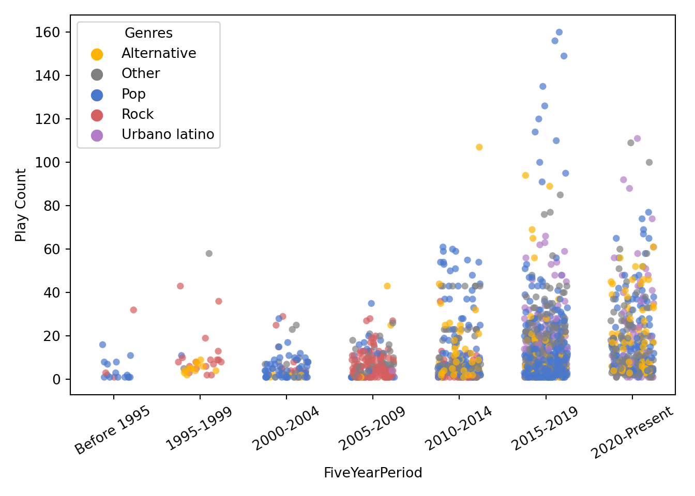
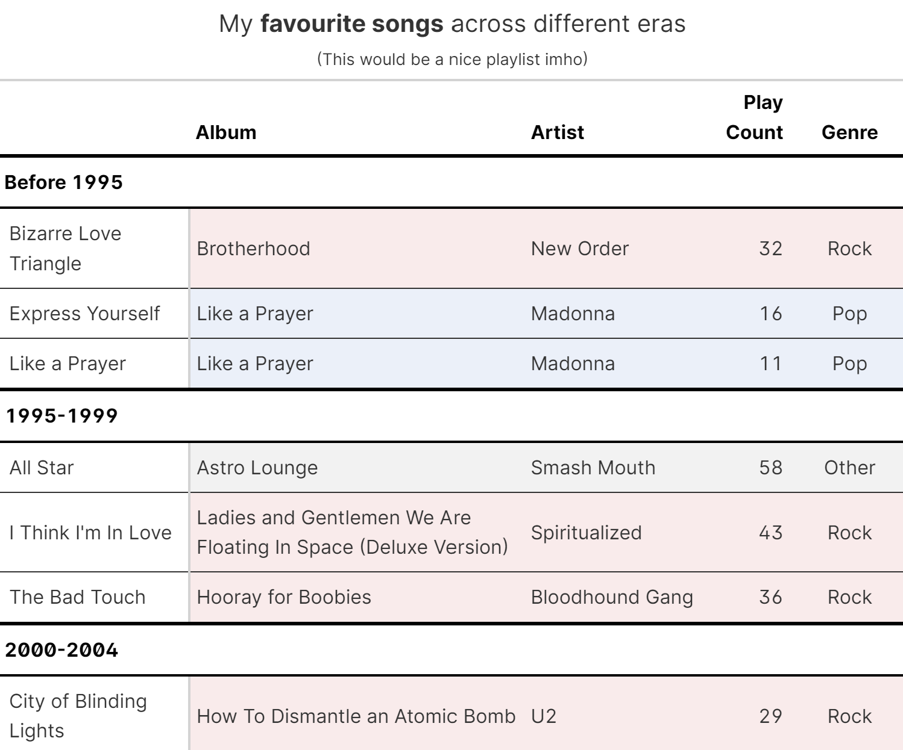

An analysis of my iTunes music collection that I did to put into practice what I learnt with the book [*Python for Data Analysis*](https://www.oreilly.com/library/view/python-for-data/9781491957653/)*,* from Wes McKinney (creator of `pandas`).

This analysis involved:

-   Importing and wrangling data in XML format (the *iTunes Library.xml* file) using Python libraries and turning it into `pandas`' dataframes.

-   Using `pandas`' data manipulation functions to answer questions such as *Which are my most listened to songs, albums and artists?* or *Which genres predominate in each decade of my music?* It was trickier than it sounds because of collaborations/remixes: songs attributed to multiple artists in which there is no standard format for how or where the contributors' names should be written, so, regular expressions to the rescue.

-   Creating visualisations of my findings with `seaborn` and `matplotlib`. For example:

Finally, I expanded the analysis by passing the cleaned pandas dataframes to R through `reticulate` and then created a "Most listened to" song ranking by era and genre in HTML format using the package `gt` (a.k.a. the *grammar of tables*).

See the complete analysis [here](https://www.franciscoyira.com/post/music-analysis-python-pandas-matplotlib-r/).
