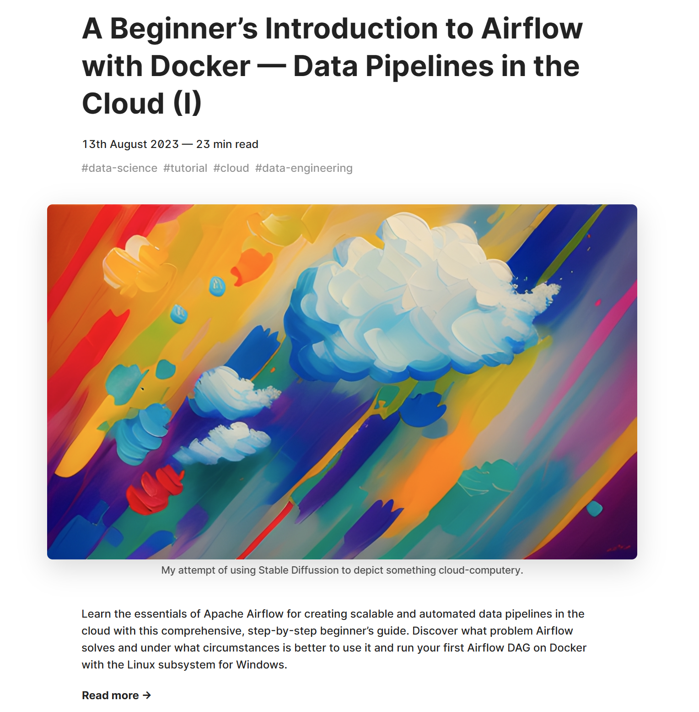

Development of an end-to-end ETL process with **Apache Airflow** that interfaces with **AWS services** such as S3 (bucket storage) and RDS (cloud relational databases).

The project included:

- Setting up the Airflow environment with **Docker** (on Linux).
- Provisioning and configuring AWS services with the **AWS Command Line Interface**.
- Configuring the Airflow environment to interact with the AWS services.
- Writing **Python and SQL** scripts to perform the tasks in the pipeline.
- Developing the **Airflow DAG** (Directed Acyclic Graph) to define the tasks and their dependencies, including handling of edge cases (e.g. there is no new data on S3 when the pipeline runs).

## The Data Pipeline

1. Reads CSV data automatically from an **S3 bucket**, using the *Last Modified Date* of the files to determine whether they're new (and process them) or not (and skip them).
2. Performs relevant transformations (cleaning and pivoting) with `pandas` to make the data more suitable for dashboards and reports.
3. **UPSERTS** the results through SQL into a **PostgreSQL database** on Amazon RDS. *UPSERT* means that data corresponding to new records will be appended to the table, whereas data about existing records will overwrite or update the previous information.

## Blog Posts

Along with the project code, I wrote a series of detailed tutorials explaining the use of Airflow, Docker, and the AWS Command Line, as well as the setup of the pipeline itself.

- [A Beginner’s Introduction to Airflow and Docker](https://www.franciscoyira.com/post/data-pipelines-cloud-intro-airflow-docker/)
- [Using Amazon Web Services with the Command Line](https://www.franciscoyira.com/post/aws-command-line-data-pipelines-cloud-part-2/)
- [Building an Airflow Pipeline That Talks to AWS](https://www.franciscoyira.com/post/airflow-pipeline-with-aws-data-cloud-part-3/)
