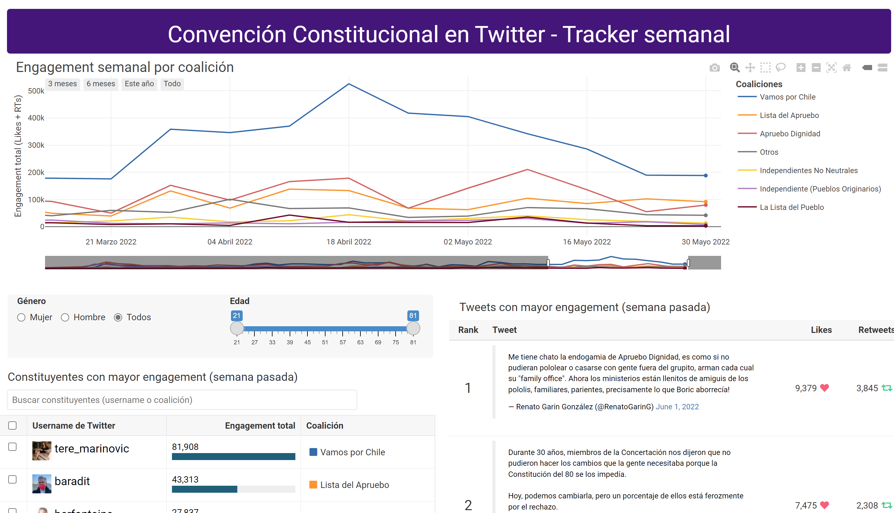
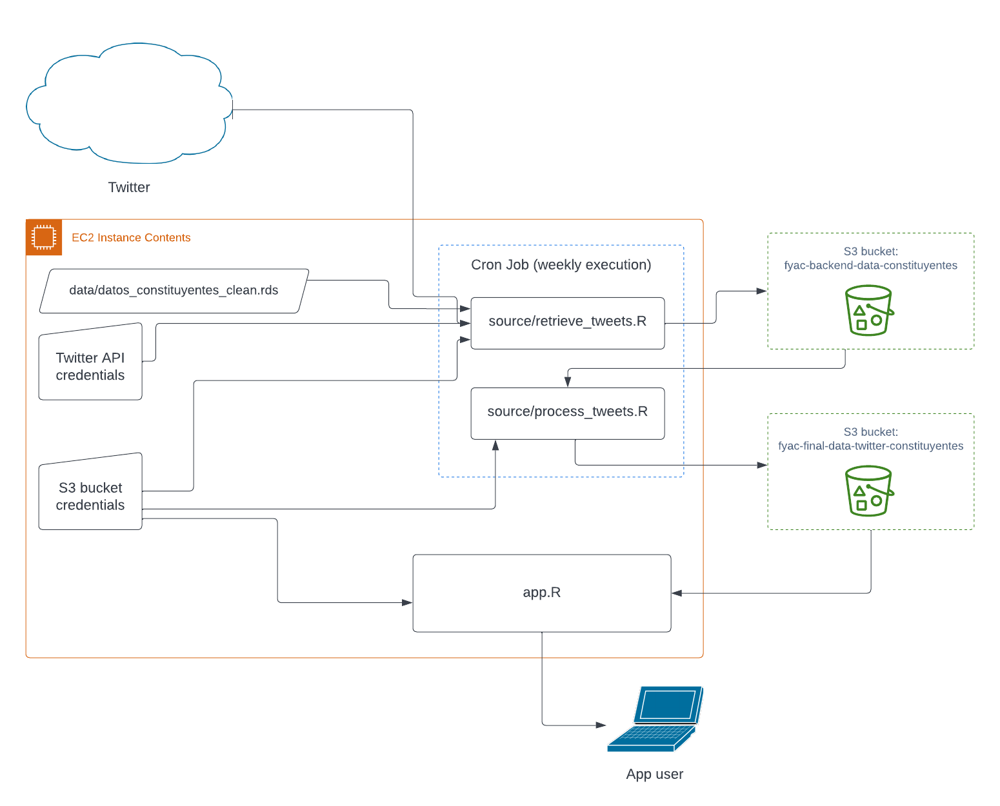

This project consists of a Shiny app that automatically retrieves the latest tweets from the 150 politicians who drafted the 2022 Chilean constitution proposal and displays a set of interactive visualisations using that data. The visualisations focus on measuring the engagement (Likes and Retweets) that the constituents' tweets get and allow reading the most engaged tweets without leaving the app.

## How it works

The data is retrieved using `rtweet` (an R wrapper for the Twitter API) and then wrangled and exported incrementally to an S3 bucket in `.rds` format. This process runs once per week automatically via a Cron Job on EC2.

The same EC2 instance also runs the `app.R` script, which corresponds to the Shiny app itself. This app is connected to the S3 bucket that contains the output of the data pipeline and retrieves the data from there when changes are detected.

## How to use it

The user interface of the app consists in the following visualisations:

-   A `plotly` line-plot on the top that displays the trends in total engagement by political coalition. It shows data since the beginning of the drafting of the constitution proposal.

-   A `reactable` on the bottom-left showing a descending ranking of politicians based on the engagement they got on Twitter during the last week. This table supports instant search by Twitter handle or political coalition name and allows filtering based on demographic features of the constituents (age and gender).

-   Another `reactable` on the bottom-right that displays a ranking of the tweets themselves, sorted by total engagement. It also shows the number of Likes and Retweets and allows sorting by one of these instead of total engagement (the sum of the two).

The visualisations are linked to each other through Shiny's reactive programming, allowing you to filter some of them by selecting elements in another one. The supported reactive interactions are the following:

-   You can click on one (or several) coalition(s) on the legend of the top plot and the `reactable`s at the bottom will be updated to only show data from the selected coalitions.

-   You can select specific constituents on the `reactable` on the bottom-left and the ranking of tweets on the right gets updated to only show tweets from the selected constituents.

## Code

These GitHub repositories contain more technical details about the inner working of the app along with instructions about how to get it running in a new environment from scratch:

- [Repo of the Shiny app itself](https://github.com/franciscoyira/twitter-constituyentes)
- [Repo of the data pipeline](https://github.com/franciscoyira/twitter-constituyentes)